🐧 Enterprise Linux Infrastructure Lab
This is the initial final README draft.
Project Overview
This repository documents a two-node Ubuntu Server infrastructure lab.
Technologies
Ubuntu Server 24.04 LTS
VirtualBox
OpenSSH
Samba
NFS
Apache2
UFW
Bash
Cron
Features
Static IP
SSH
Samba
NFS
Apache
Automation
Monitoring
Documentation
See the documentation folder for the Installation, Configuration, Validation and Troubleshooting guides.

## 🏗️ Lab Environment

The lab was built using **Oracle VirtualBox** and consists of two Ubuntu Server virtual machines connected through a dedicated internal network.

| Virtual Machine | Hostname | Role | IP Address |
|-----------------|----------|------|------------|
| LNX-SRV01 | lnx-srv01 | Enterprise Infrastructure Server | 192.168.100.10 |
| LNX-CL01 | lnx-cl01 | Linux Client | 192.168.100.20 |

### Virtual Machine Specifications

| Component | LNX-SRV01 | LNX-CL01 |
|-----------|-----------|----------|
| Operating System | Ubuntu Server 24.04 LTS | Ubuntu Server 24.04 LTS |
| vCPUs | 2 | 2 |
| Memory | 4 GB | 2 GB |
| Disk | 40 GB | 25 GB |
| Adapter 1 | NAT | NAT |
| Adapter 2 | Internal Network (EnterpriseLab) | Internal Network (EnterpriseLab) |

---

# 🖼️ Architecture

## Infrastructure Overview

The infrastructure was designed around a simple enterprise topology where a dedicated Linux server provides infrastructure services to a separate Linux client.

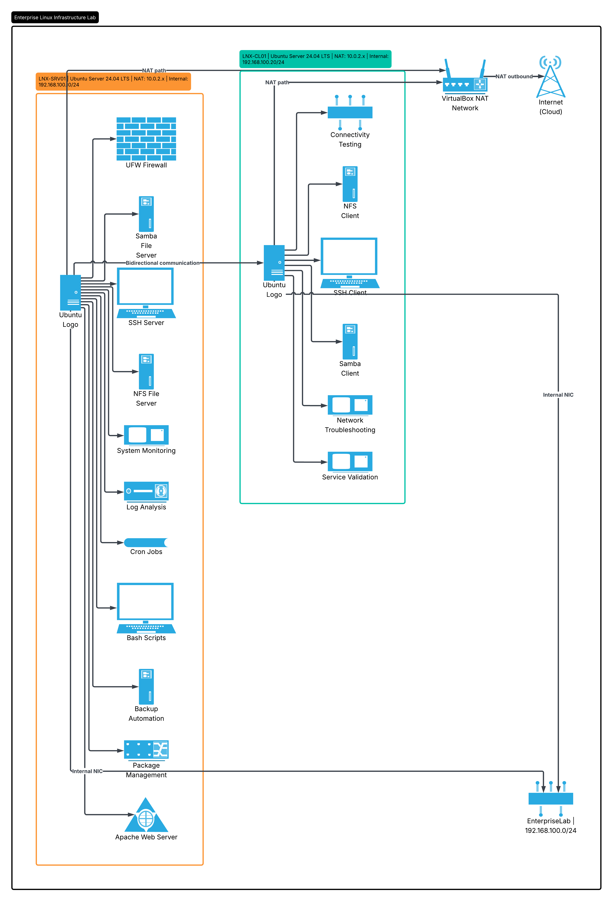

---

## Network Topology

The virtual machines communicate over an isolated VirtualBox Internal Network while retaining Internet access through a NAT adapter.

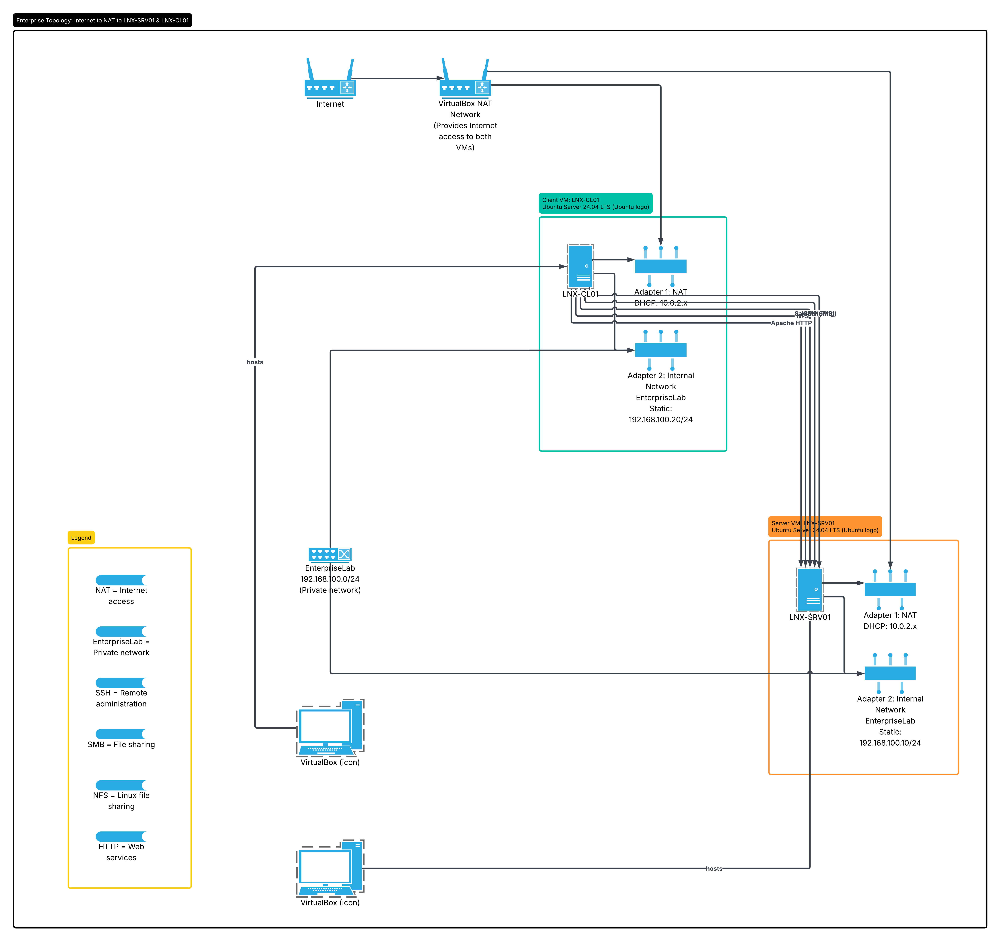

---

## Service Architecture

The server hosts multiple enterprise services which are consumed and validated from the client virtual machine.

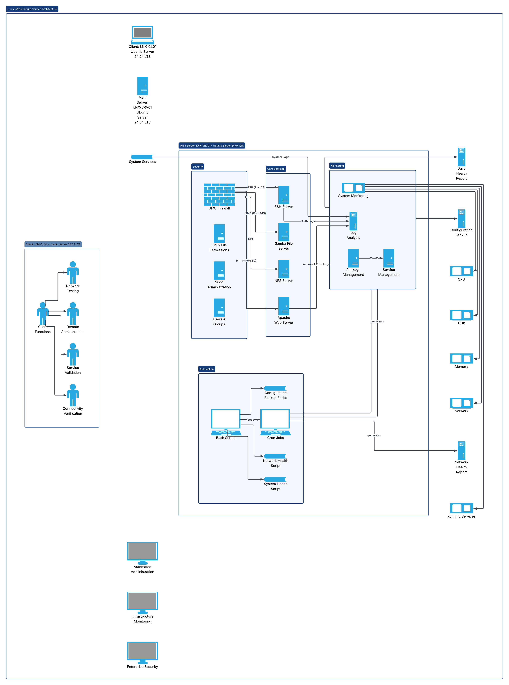

---

# 📸 Project Gallery

The following screenshots document the complete lifecycle of the project from deployment through validation.

| Step | Screenshot |
|------|------------|
| Virtual Machines | 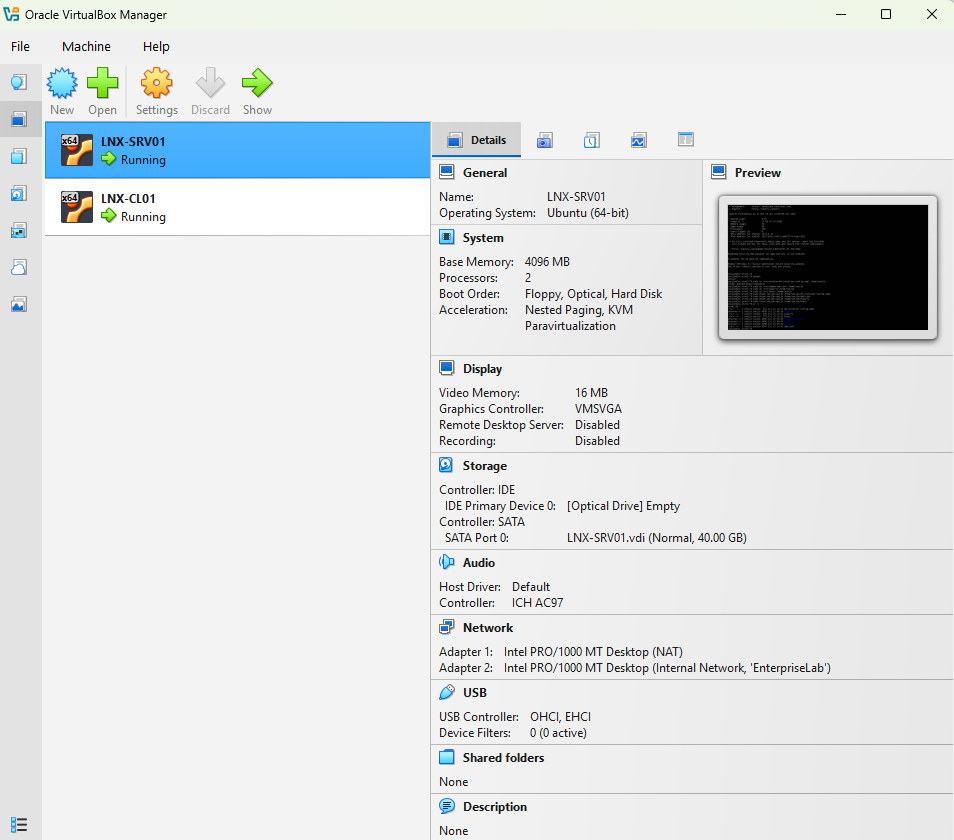 |
| Ubuntu Installation | 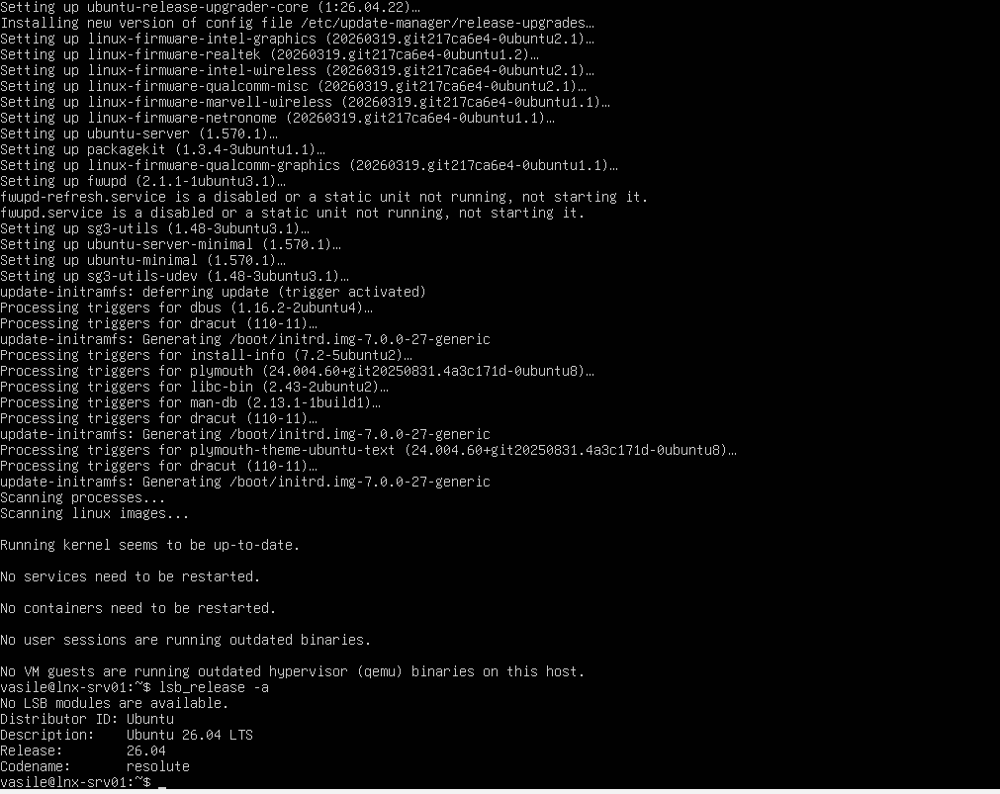 |
| Network Configuration | 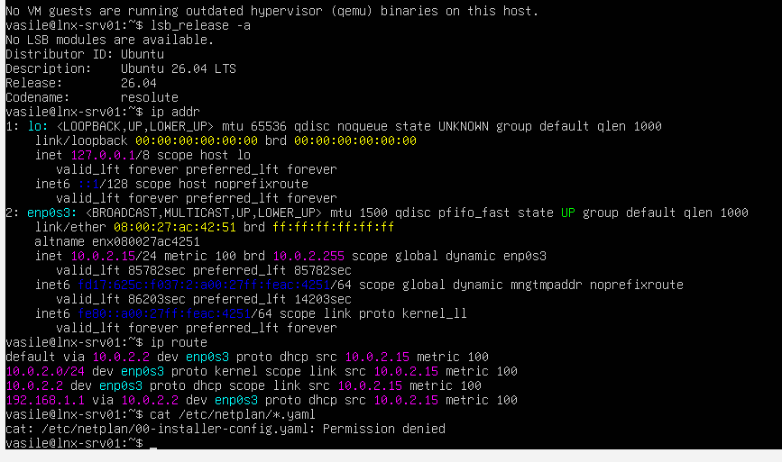 |
| Static IP Configuration | 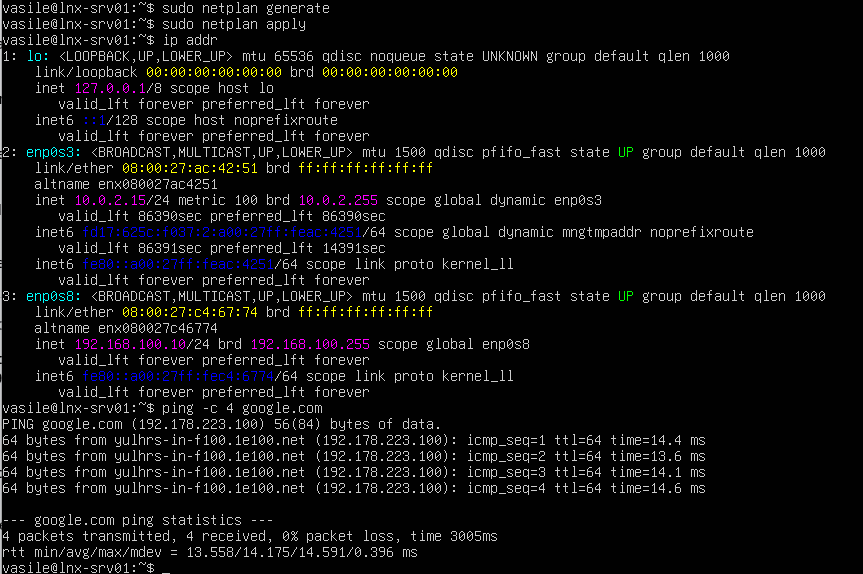 |
| SSH Connectivity | 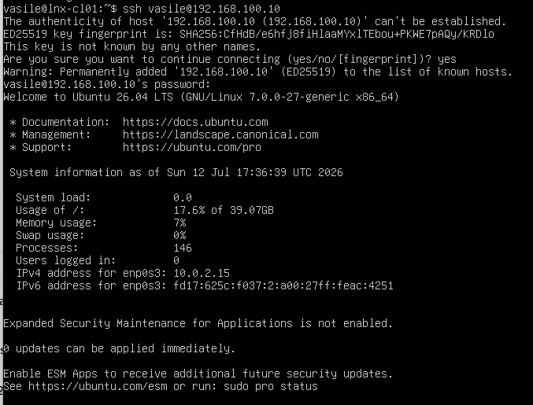 |
| User & Group Management | 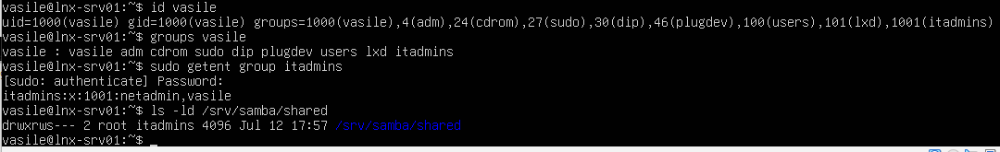 |
| Samba Configuration | 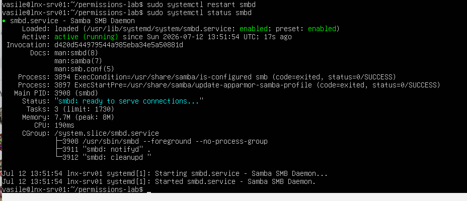 |
| NFS Configuration | 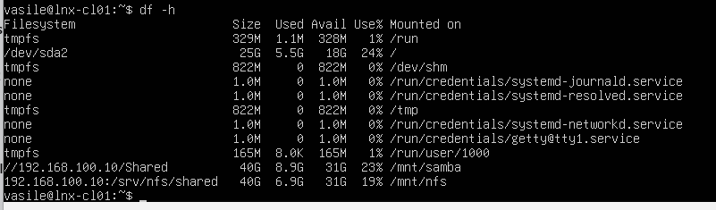 |
| Apache Web Service | 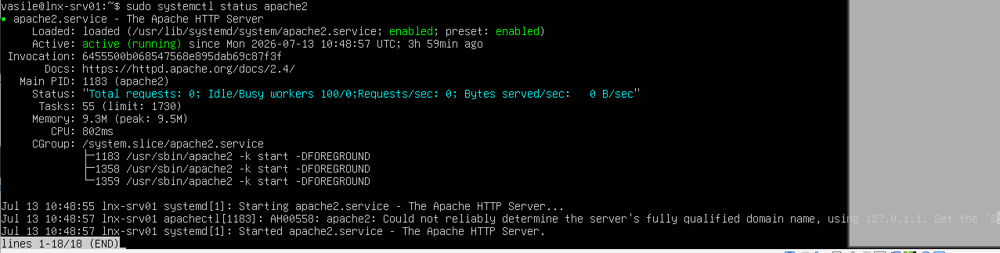 |
| UFW Firewall | 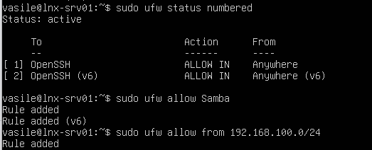 |
| Bash Automation | 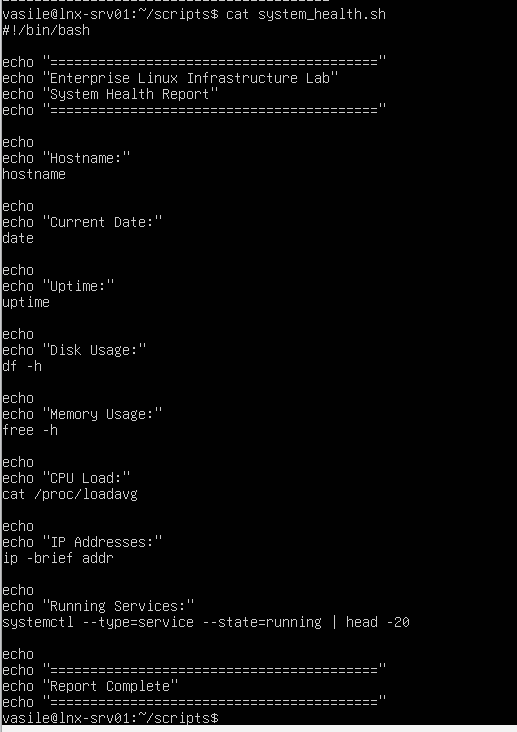 |
| Cron Scheduling | 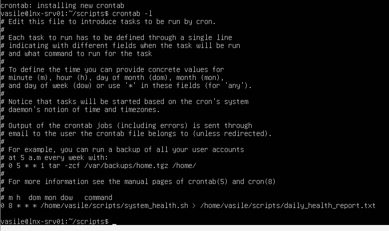 |
| System Monitoring | 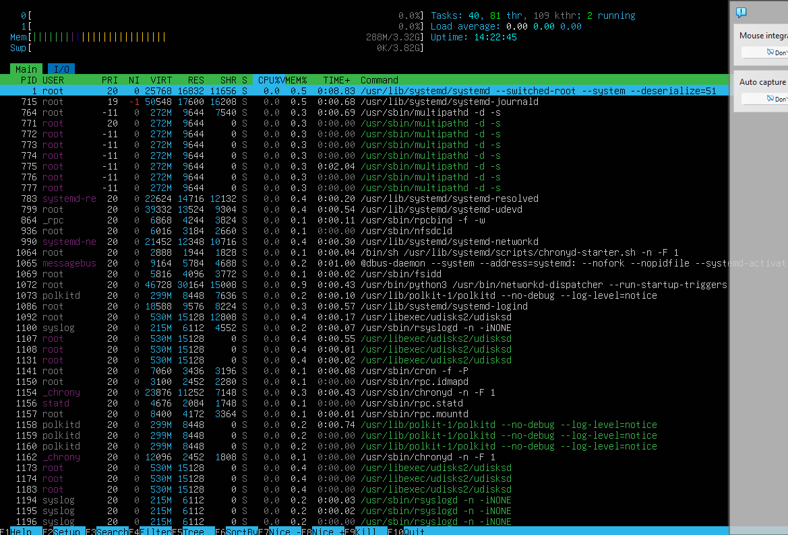 |
| Health Reporting | 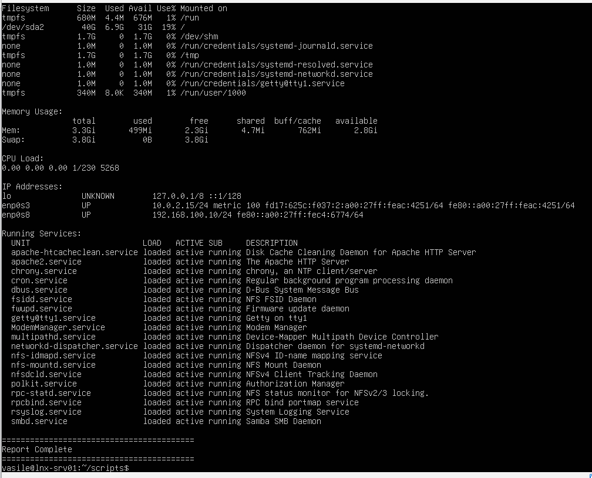 |
| Final Validation | 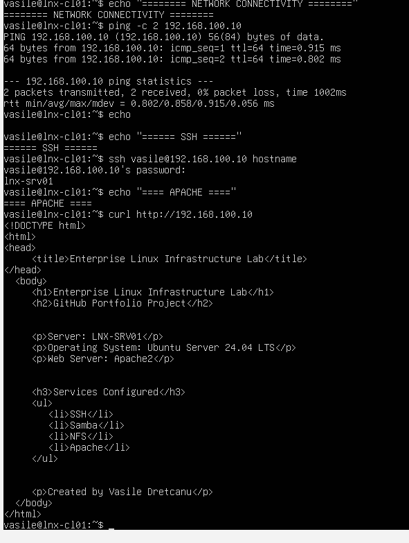 |

---

# ⭐ Key Features

- Enterprise Linux Infrastructure
- Two-node Virtual Environment
- Static IP Networking
- SSH Remote Administration
- Samba File Sharing
- NFS File Sharing
- Apache2 Web Server
- UFW Host Firewall
- Bash Automation
- Scheduled Cron Jobs
- Configuration Backups
- System Monitoring
- Infrastructure Validation

---

# 📁 Repository Structure

```text

enterprise-linux-infrastructure-lab/

│

├── configs/

│   ├── exports

│   ├── hosts

│   ├── netplan-config.yaml

│   └── smb.conf

│

├── diagrams/

│   ├── architecture-overview.png

│   ├── network-topology.png

│   └── service-architecture.png

│

├── documentation/

│   ├── Installation Guide.md

│   ├── Configuration Guide.md

│   ├── Validation Guide.md

│   ├── Troubleshooting Guide.md

│   └── Project Summary.md

│

├── reports/

├── screenshots/

├── scripts/

├── virtual-machines/

│

├── README.md

├── LICENSE

└── .gitignore

```

---

# 📚 Documentation

Detailed technical documentation is available in the **documentation/** directory.

| Document | Purpose |
|----------|---------|
| Installation Guide | Complete deployment procedure |
| Configuration Guide | Linux service configuration |
| Validation Guide | Testing and verification |
| Troubleshooting Guide | Problems encountered and solutions |
| Project Summary | Executive overview |

---

# ✅ Validation Summary

Every major component deployed during the project was tested from both the server and client virtual machines.

| Component | Validation Method | Status |
|-----------|-------------------|:------:|
| Static IP Configuration | Verified using `ip addr`, `ip route` and `ping` | ✅ |
| SSH | Remote login from LNX-CL01 | ✅ |
| SSH (Windows) | Remote login using VirtualBox NAT Port Forwarding | ✅ |
| SCP | Secure transfer of files from Linux to Windows | ✅ |
| Samba | Authenticated access and file creation | ✅ |
| NFS | Mounted share and verified read/write access | ✅ |
| Apache2 | Accessed custom web page from server and client | ✅ |
| UFW Firewall | Verified required services remained accessible | ✅ |
| Bash Scripts | Executed successfully and generated reports | ✅ |
| Cron Jobs | Confirmed scheduled execution | ✅ |
| Configuration Backups | Backup archives successfully created | ✅ |
| Monitoring | System health reports generated | ✅ |

---

# 📊 Project Statistics

| Metric | Value |
|---------|------:|
| Virtual Machines | 2 |
| Enterprise Services | 5 |
| Configuration Files | 4 |
| Bash Scripts | 3 |
| Scheduled Cron Jobs | 2 |
| Architecture Diagrams | 3 |
| Documentation Files | 5 |
| Screenshots | 15 |
| Validation Tests | 12+ |

---

# 💡 Lessons Learned

Building this project strengthened my practical understanding of Linux systems administration and enterprise infrastructure deployment.

Some of the most valuable lessons included:

- Designing and deploying a multi-machine Linux environment.
- Configuring static networking using Netplan.
- Managing Linux users, groups and file permissions.
- Implementing secure remote administration with OpenSSH.
- Deploying Samba and NFS file sharing services.
- Hosting web content using Apache2.
- Protecting services with UFW firewall rules.
- Automating routine administration using Bash and Cron.
- Monitoring Linux systems using built-in administration tools.
- Troubleshooting configuration and permission issues.
- Producing structured technical documentation suitable for professional environments.

---

# 🚀 Future Improvements

This lab provides a strong foundation for future expansion.

Planned enhancements include:

- Docker container deployment
- Ansible configuration management
- Nginx Reverse Proxy
- Fail2Ban intrusion protection
- Bind9 DNS Server
- Prometheus monitoring
- Grafana dashboards
- Microsoft Azure integration
- Active Directory integration
- High Availability services

---

# 🎯 Why This Project Matters

This project demonstrates far more than installing an operating system.

It shows the complete lifecycle of a small enterprise infrastructure deployment:

- Planning
- Deployment
- Configuration
- Security
- Automation
- Monitoring
- Validation
- Troubleshooting
- Documentation

These are the same stages followed in many real-world infrastructure projects and form the foundation of day-to-day systems administration.

---

# 👨‍💻 About the Author

## Vasile Dretcanu

Computing (Networking) graduate with a strong interest in Infrastructure Engineering, Linux Administration, Enterprise Networking and Automation.

This project forms part of a growing technical portfolio demonstrating practical, hands-on experience with enterprise technologies.

Current areas of focus include:

- Enterprise Networking
- Linux Administration
- Windows Server Infrastructure
- Python Network Automation
- Microsoft Azure
- CCNA Certification

---

# 📄 License

This project is released under the **MIT License**.

See the **LICENSE** file for full details.

---

# ⭐ Acknowledgements

This project was developed as part of my professional infrastructure engineering portfolio to demonstrate practical Linux administration, automation, troubleshooting and documentation skills using enterprise-inspired technologies.

If you found this repository useful, feel free to explore the other projects in my GitHub portfolio.
